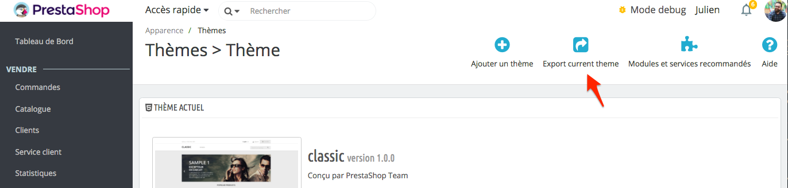

# Exporting your theme

## Creating a valid ZIP file

A theme is installed as soon as it is on the disk.

If you want the theme to appears in the backoffice, it only needs to contain a `config/theme.yml` file.
This will only display it, if you want to select it as your active theme, it has to be valid. Read ["What
makes a valid theme"]().




Once it is active you can export your theme using the _"Export current theme"_ button or use the command
from your terminal.

```bash
php bin/console prestashop:theme:export THEME_DIRECTORY_NAME
```

### What is exported

Exporting your theme using the button or the command line will export the following data:

* All theme files in directory
* Dependencies specified in `theme.yml` ([See theme.yml doc]())
* Theme translations

