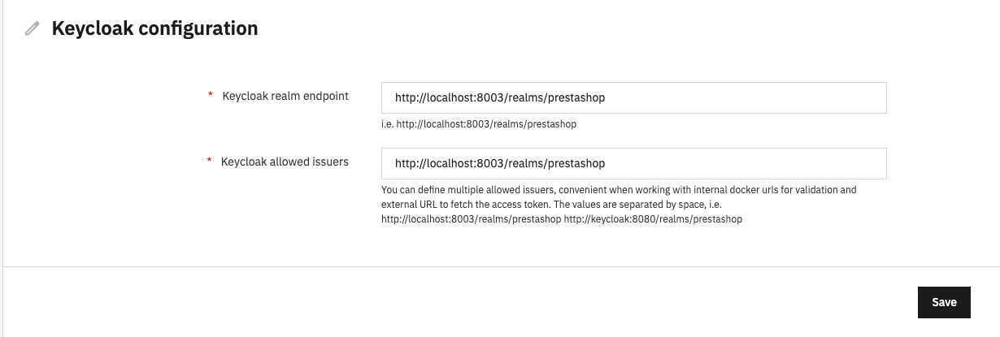

# External authorization server

You can use an external authorization server to access your resources, to do that you need to install a module that implements our `PrestaShop\PrestaShop\Core\Security\OAuth2\AuthorisationServerInterface` interface.

As an example, we developed a [keycloak_connector_demo module](https://github.com/PrestaShop/keycloak_connector_demo) based on the [Keycloak authorization server](https://www.keycloak.org/).

This module includes a [Docker](https://www.docker.com/) configuration that allows you to launch a Keycloak server locally for development purposes. It includes:
- Keycloak authorization server and its admin interface
- One default client
- Some default scopes matching the ones from the core

{}
Thanks to this implementation, any authorization server can interact with and authorize the Admin API. However, both need a common contract based on the scopes defined on each endpoint of the resource server. So, you will need to provide your authorization server with a list of scopes mapping the ones used by the endpoints.
{}

## Keycloak server initialization

To start the Docker container, run this command from the root folder of the module:

```bash
docker compose up
# OR if you want Keycloak to keep running in the background
docker compose up -d
```

You will then have access to the server administration via `http://localhost:8003` where you will find a realm named `prestashop`
User: `admin`
Password: `admin`

## Module installation and configuration

Clone the module repository into your `modules` folder, then go to the Module manager in your back office and install the `Keycloak OAuth2 connector demo` module.

Then go to the configuration and provide the two needed URLs for configuration:

- **Keycloak realm endpoint**: The URL on which your server can access the Keycloak realm endpoint, this is the base realm URL from which the connector can fetch the certificates and validate if the JWT Token is valid.
- **Keycloak allowed issuers**: A list of issuer values that are considered valid, usually it's the same as the realm endpoint, but in case you request your access token from different URLs, you can specify multiple endpoints, so the validation process accepts multiple issuers.

If you're using the included Docker locally, then the default configuration should be enough:



{}
For security reasons, the values in this form are encrypted in the database.
{}

## Authorization server implementation

You can see the [exact implementation of the authorization server](https://github.com/PrestaShop/keycloak_connector_demo/blob/v1.1.0/src/OAuth2/KeycloakAuthorizationServer.php) in the module itself, but here is an explanation about what each method does:

```php
namespace PrestaShop\Module\KeycloakConnectorDemo\OAuth2;

class KeycloakAuthorizationServer implements AuthorisationServerInterface
{
    public function isTokenValid(Request $request): bool
    {
        // Parses the JWT Token and check if it's valid
        // Fetch the list of allowed issuers from the configuration, if the Token issuer matches one of the allowed ones
        // Fetch the URL realm from the configuration (ex: http://localhost:8003/realms/prestashop)
        // Download the certificates from the authorization server (ex: http://localhost:8003/realms/prestashop/protocol/openid-connect/certs)
        // Check if the JWT token was correctly signed based on the public certificate
        // If all these checks passed then the token is valid and issued by Keycloak and the method returns true

        // Any failure along this test the method returns false
    }

    public function getJwtTokenUser(Request $request): ?JwtTokenUser
    {
        // Parses the JWT token from the request, it should contain these claims
        //  - clientId: The used client ID to get the access token
        //  - scope: a list of scope separated by spaces
        //  - iss: the issuer that granted the access token (ex: http://localhost:8003/realms/prestashop)
        // With these three data the method can return a JwtTokenUser DTO
    }
}
```

Once your service is implemented, you need to define in your module's services that PrestaShop will automatically scan and detect it. You should rely on `autoconfigure` and `autowire` to make sure your implementation is correctly identified:

```yaml
services:
  PrestaShop\Module\KeycloakConnectorDemo\OAuth2\KeycloakAuthorizationServer:
    # Autoconfigure to get tag from interface and to be injected in TokenAuthenticator
    autoconfigure: true
    autowire: true
    arguments:
      $client: '@prestashop.module.keycloak_connector_demo.client'
      $phpEncryption: '@prestashop.module.keycloak_connector_demo.php_encrypt'
```

Now your implementation will be used by the `TokenAuthenticator` in the loop that checks for authorization servers in each request of the resource server.

## Getting an access token

The `prestashop` realm includes a client already configured, you can get an access token via this endpoint http://localhost:8003/realms/prestashop/protocol/openid-connect/token with following credentials (use Form URL encoded request):
- **grant_type**: `client_credentials`
- **client_id**: `prestashop-keycloak`
- **client_secret**: `O2kKN0fprCK2HWP6PS6reVbZThWf5LFw`

The included scopes are:
- `api_client_read`
- `api_client_write`
- `product_read`
- `product_write`

Example request using curl:

```bash
curl --request POST \
  --url http://localhost:8003/realms/prestashop/protocol/openid-connect/token \
  --data grant_type=client_credentials \
  --data client_id=prestashop-keycloak \
  --data client_secret=O2kKN0fprCK2HWP6PS6reVbZThWf5LFw \
  --data 'scope=api_client_read api_client_write'
```

Example request using Insomnium:



You can use the [JWT.io](https://jwt.io/) to parse your JWT token and see its content, you will see that the Keycloak payload has this structure:

```json
{
  "exp": 1725577479,
  "iat": 1725577179,
  "jti": "d939d2e1-edca-4ecc-b649-76131dc3c528",
  "iss": "http://localhost:8003/realms/prestashop",
  "aud": "account",
  "sub": "f1bda963-3316-4a4e-84ee-1dbe20b78a0a",
  "typ": "Bearer",
  "azp": "prestashop-keycloak",
  "acr": "1",
  "allowed-origins": [
    "/*"
  ],
  "realm_access": {
    "roles": [
      "offline_access",
      "uma_authorization",
      "default-roles-prestashop"
    ]
  },
  "resource_access": {
    "prestashop-keycloak": {
      "roles": [
        "uma_protection"
      ]
    },
    "account": {
      "roles": [
        "manage-account",
        "manage-account-links",
        "view-profile"
      ]
    }
  },
  "scope": "api_client_read profile api_client_write email",
  "clientHost": "192.168.207.1",
  "email_verified": false,
  "preferred_username": "service-account-prestashop-keycloak",
  "clientAddress": "192.168.207.1",
  "client_id": "prestashop-keycloak"
}
```

In this payload you can see the three parameters we mentioned earlier `client_id`, `scope` and `iss`.

