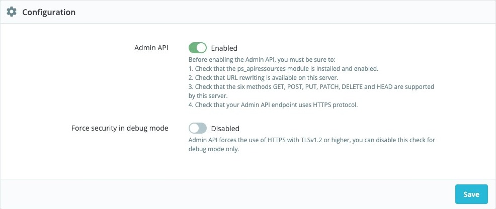
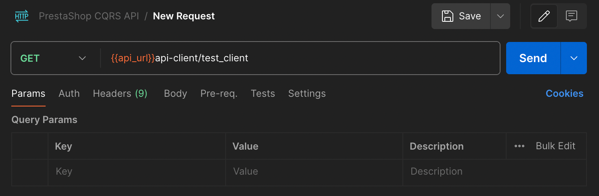
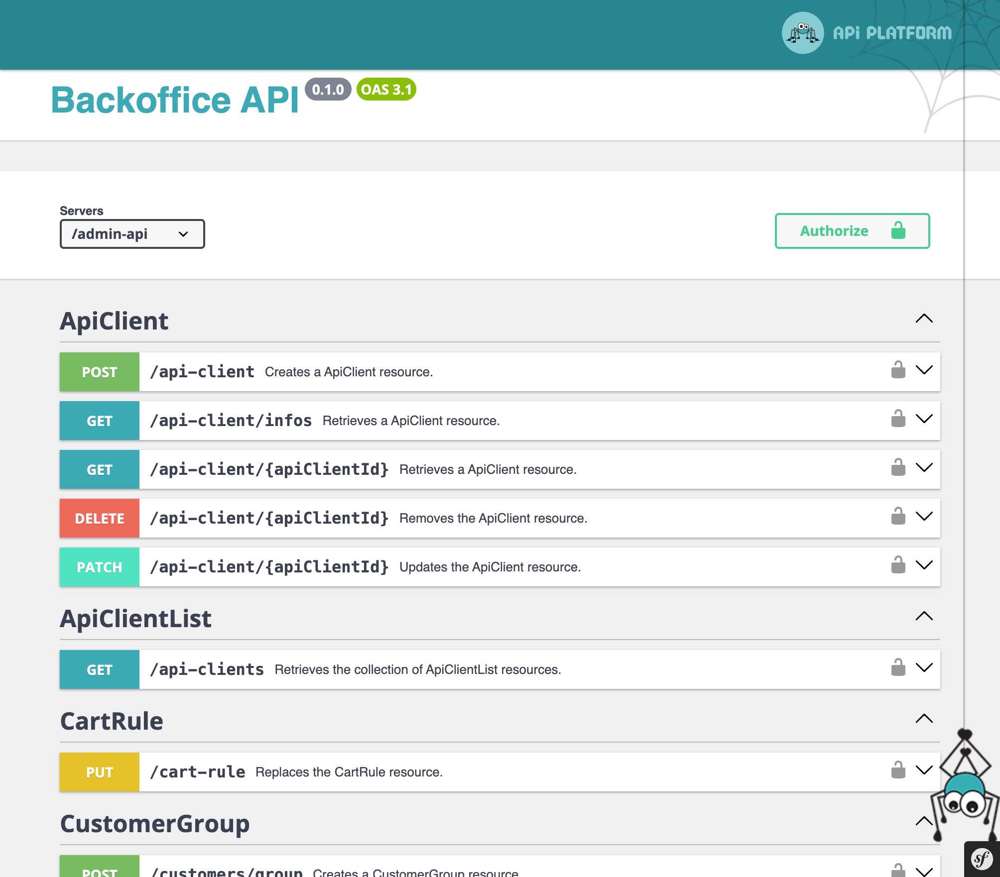
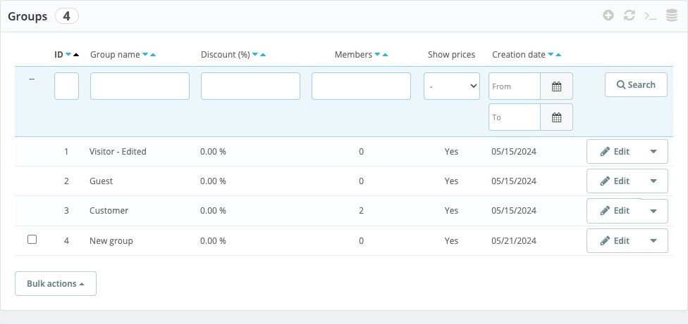
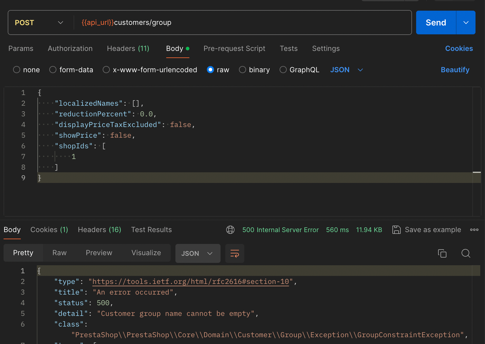

# How to use the Admin API

## Setting up the Admin API

The Admin API is enabled by default is PrestaShop 9, so it's available out of the box when you install PrestaShop 9.

You may want to disable checking for HTTPS with TLSv1.2. To do that, go to Advanced Parameters -> Admin Api -> Configuration and disable the "Force security in debug mode" option. If you don't see this option, make sure to enable Debug mode first in Advanced Parameters -> Performance.

{}
You can disable the forced secured protocol in the configuration but **only** with the debug mode enabled. Production mode is strictly secured and you need HTTPS to connect to the API.
{}



## Oauth2 terminology

Before we continue with the tutorial, we have included a table below that will help you understand some of the terms used in this article.

| Element                  | Description                                                                                                                              |
|--------------------------|------------------------------------------------------------------------------------------------------------------------------------------|
| **Resource Owner**       | Entity that can grant access to a protected resource (usually the end user).                                                             |
| **Client**               | Application requesting access to a protected resource on behalf of the Resource Owner.                                                   |
| **Access Token**         | A token used to access protected resources                                                                                               |
| **Resource Server**      | Server hosting the protected resources capable of accepting and responding to requests using access tokens.                              |
| **Authorization Server** | A server which issues access tokens after successfully authenticating a client and resource owner, and authorizing the request.          |
| **Scope**                | A permission that grants access to one or several resources.                                                                             |
| **JWT Token**            | Or JSON Web Token  is a method for representing claims securely between two parties.                                                     |
| **Grant Type**           | The protocol has several types or workflow to validate authentication known as grant types (Authorization Code, Client Credentials, ...) |

Now, let's proceed to the next step.

## Getting an access token

Tha Admin API can be authorized via the internal authorization server or an external one, but fetching an access token is always done in one request to the authorization server. For more details see the solution for your use case:

- [internal authorization server]()
- [external authorization server]()

## Information about the API Client

Now that we have the access token, we can get information about the API client. To do that, you need to send a GET request to the `/admin-api/api-client/info` endpoint and provide the access token in the `Authorization` header.

Example request using curl:

```bash
curl --location 'http://yourdomain.test/admin-api/api-client/infos' \
--header 'Authorization: Bearer YOUR_ACCESS_TOKEN'
```

Example request using Postman:



If everything goes well, you should receive a response with information about the API client. The response should look like this:

```json
{
    "apiClientId": 1,
    "clientId": "test_client",
    "clientName": "Test client",
    "description": "",
    "enabled": true,
    "lifetime": 3600,
    "scopes": [
        "api_client_read",
        "api_client_write",
        "cart_rule_write",
        "customer_group_read",
        "customer_group_write",
        "hook_read",
        "hook_write",
        "module_read",
        "module_write",
        "product_read",
        "product_write"
    ]
}
```

Congrats! You have successfully authenticated your client and retrieved information about it. You can now use the access token to access other endpoints in the API.

Please note that the list of scopes may vary depending on the client you created. It is also important to note that the list of scopes here is the list of all scopes the client can use, not the list of scopes the client is using at the moment, with the generated access token.

If you request an endpoint without the required scope, you will receive an error message. For example, if you try to access the `/admin-api/products` endpoint without the `product_read` scope in your access token, you will receive the following response:

```json
{
    "type": "https://tools.ietf.org/html/rfc2616#section-10",
    "title": "An error occurred",
    "status": 403,
    "detail": "Invalid scope.",
    "class": "Symfony\\Component\\HttpKernel\\Exception\\AccessDeniedHttpException",
    "trace": []
}
```

## Retrieve a single resource

Now that you have a better understanding of how to authenticate your client and retrieve information about it, you can try to retrieve other resources from the API. You can use the access token you generated earlier to authenticate your client.

In the following example, we will try retrieving and saving user group information. To do that, you need to send a `GET` request to the `/admin-api/customers/group/{customerGroupId}` endpoint, where `{customerGroupId}` is the ID of the user group you want to retrieve. You need to provide the access token in the `Authorization` header.

```bash
curl --location 'http://yourdomain.test/admin-api/customers/group/1' \
--header 'Authorization: Bearer YOUR_ACCESS_TOKEN'
```

If everything goes well, you should receive a response with information about the user group. The response should look like this:

```json
{
    "customerGroupId": 1,
    "localizedNames": {
        "1": "Odwiedzający",
        "2": "Visitor"
    },
    "reductionPercent": 0.0,
    "displayPriceTaxExcluded": false,
    "showPrice": true,
    "shopIds": [
        1
    ]
}
```

Notice that you can access the localized names of the user group and all other relevant information.

If you access the endpoint with the wrong ID, you will receive an error message. For example, if you try to access the `/admin-api/customers/group/999999` endpoint, you will receive the following response:

```json
{
    "type": "https://tools.ietf.org/html/rfc2616#section-10",
    "title": "An error occurred",
    "status": 500,
    "detail": "Group #4 was not found",
    "class": "PrestaShop\\PrestaShop\\Core\\Domain\\Customer\\Group\\Exception\\GroupNotFoundException",
    "trace": []
}
```

The endpoint will return a 404 status code and an error message saying the group was not found.

{}
If you search for a list of all available resources, you can use the http://yourdomain.test/admin-api/docs.html URL to access the API documentation. The documentation is generated automatically and provides information about all available endpoints, request methods, and parameters.
{}



## Editing a single resource

Now that you know how to retrieve information about a single resource, you can try to edit it. To do that, you need to send a `PUT` request to the `/admin-api/customers/group/{customerGroupId}` endpoint, where `{customerGroupId}` is the ID of the user group you want to edit. You need to provide the access token in the `Authorization` header and the data you want to change in the request body.

You can send the following JSON data to change the user group name:

```json
{
    "localizedNames": {
        "1": "Odwiedzający - Edytowany",
        "2": "Visitor - Edited"
    }
}
```

Full `curl` request:

```bash
curl --location --request PUT 'http://yourdomain.test/admin-api/customers/group/1' \
--header 'Content-Type: application/json' \
--header 'Authorization: Bearer YOUR_ACCESS_TOKEN' \
--data '{
    "localizedNames": {
        "1": "Odwiedzający - Edytowany",
        "2": "Visitor - Edited"
    }
}'
```

If everything goes well, you should receive a response with information about the user group. The response should look like this:

```json
{
    "customerGroupId": 1,
    "localizedNames": {
        "1": "Odwiedzający - Edytowany",
        "2": "Visitor - Edited"
    },
    "reductionPercent": 0.0,
    "displayPriceTaxExcluded": false,
    "showPrice": true,
    "shopIds": [
        1
    ]
}
```

Notice that the user group name has been changed. You can now use the same method to edit other resources in the API. Let's now proceed to the next step.

## Adding a new resource

Now that you know how to retrieve and edit information about a single resource, you can try to add a new resource. To do that, you must send a `POST` request to the `/admin-api/customers/group` endpoint. You need to provide the access token in the `Authorization` header and the data you want to add to the request body.

You can send the following JSON data to add a new user group:

```json
{
    "localizedNames": {
        "1": "Nowa grupa",
        "2": "New group"
    },
    "reductionPercent": 0.0,
    "displayPriceTaxExcluded": false,
    "showPrice": true,
    "shopIds": [
        1
    ]
}
```

Full `curl` request:

```bash
curl --location 'http://yourdomain.test/admin-api/customers/group' \
--header 'Content-Type: application/json' \
--header 'Authorization: Bearer YOUR_ACCESS_TOKEN' \
--data '{
    "localizedNames": {
        "1": "Nowa grupa",
        "2": "New group"
    },
    "reductionPercent": 0.0,
    "displayPriceTaxExcluded": false,
    "showPrice": true,
    "shopIds": [
        1
    ]
}'
```

This time, you should receive a response with information about the newly created user group. The response should look like this:

```json
{
    "customerGroupId": 4,
    "localizedNames": {
        "1": "Nowa grupa",
        "2": "New group"
    },
    "reductionPercent": 0.0,
    "displayPriceTaxExcluded": false,
    "showPrice": true,
    "shopIds": [
        1
    ]
}
```

and you will see the new user group in the PrestaShop back office.



If you don't provide all the necessary information, you will receive an error message. For example, if you try to add a new user group without providing the `localizedNames` parameter, you will receive the following response:



## Deleting a single resource

To delete a resource, you need to send a `DELETE` request to the `/admin-api/customers/group/{customerGroupId}` endpoint, where `{customerGroupId}` is the ID of the user group you want to delete.

```bash
curl --location --request DELETE 'http://yourdomain.test/admin-api/customers/group/4' \
--header 'Authorization: Bearer YOUR_ACCESS_TOKEN'
```

## Importing API collection to your API client

Thanks to the automatically generated documentation, you can easily import the API collection into Postman or another API client of your choice. You can find the collection in the `http://yourdomain.test/admin-api/docs.json` URL. The collection is available in the OpenAPI format, compatible with Postman and other API clients.

## Extending API

The new API in PrestaShop 9 is designed to be extensible. You can add new endpoints, scopes, and other features to the API. We plan to release extensive developer documentation for the API soon. In the meantime, you can check the [example module](https://github.com/PrestaShop/example-modules/tree/master/api_module) and the [ps_apiresources](https://github.com/PrestaShop/ps_apiresources).

