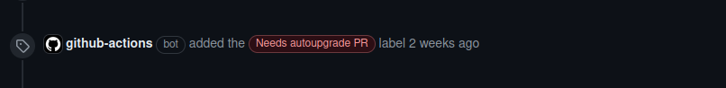

# Upgrade Contributions: Best Practices and Essential Tips

There are elements to consider if a modification has been made to the structure of the database in a contribution to the PrestaShop project, specifically a contribution to the Core.

During a contribution, if there's a change in the structure of the given database, the "Needs autoupgrade PR" label is added. It indicates that another pull request is required to ensure the proper functioning of the upgrade process to the relevant version.

This label is the result of verifications executed on each pull request, where a comparison of stores is done against the base and your branch. If differences are found, this means a store upgrading to a version containing your changes will require its content to be migrated.

It is essential to keep the upgrade process up to date according to the changes made to the Core to ensure the proper functioning of upgrades for different versions of PrestaShop.

## How do we determine which content is affected and what needs to be added?

When there's a modification to the `db-structure.sql` file or if a Doctrine entity has been modified, added, or deleted, it impacts the database structure. Modifying the list of hooks, feature flags, new configurations (or generally new base fixtures) has consequences on the upgrade process as well.

These changes can affect how the application interacts with the database and how upgrade procedures are handled.

It's important to consider these aspects when contributing to ensure a smooth upgrade experience for users.

{}
The core command `prestashop:schema:update-without-foreign --dump-sql` allows you to retrieve the queries needed to update the database according to changes made to the Doctrine entities.

It is also possible to retrieve a diff of SQL dumps made in the summary of the GitHub actions `Check the label 'Needs autoupgrade PR'` if the label was added automatically.
{}

## Autoupgrade Module contribution

Also known as the “1-click upgrade module”, the autoupgrade module is responsible for running the upgrade process on PrestaShop stores. This is when upgrade migration files should be added if the pull request is labeled “Needs Autoupgrade PR.”

Contributions related to the upgrade process should be targeted towards the [Autoupgrade repository](https://github.com/PrestaShop/autoupgrade), and more specifically in one of these [upgrade scripts](https://github.com/PrestaShop/autoupgrade/tree/dev/upgrade/sql).
Reading the Project Modules section will explain the basics of contributing to the [PrestaShop module][1]

## Changes related to modules

Modules manage their own table and columns and there is currently no automatic checking of modules upgrade scripts requirement. Migration files must be joined to the pull request that makes changes to the database.

[1]: 
