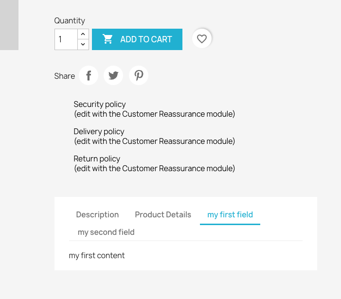

{}

## Call of the Hook in the origin file

```php
<?php
$product['extraContent'] = (new ProductExtraContentFinder())->addParams(['product' => $this->product])->present();
```

## Example implementation

This hook has been implemented as an example in our [example-modules repository - demoproductextracontent](https://github.com/PrestaShop/example-modules/tree/master/demoproductextracontent).

## Hook explained

This hook is a little more complicated than the other ones. It renders the provided content on the theme level. By default, it uses Bootstrap tabs to display it:

```php
{foreach from=$product.extraContent item=extra key=extraKey}
    <div class="tab-pane fade in {$extra.attr.class}" id="extra-{$extraKey}" role="tabpanel" {foreach $extra.attr as $key => $val} {$key}="{$val}"{/foreach}>
        {$extra.content nofilter}
    </div>
{/foreach}
```

In the front office, `ProductController` fetches all extra content using a `ProductExtraContentFinder`. 

```php
class ProductExtraContentFinder extends HookFinder
{
    protected $hookName = 'displayProductExtraContent';
    protected $expectedInstanceClasses = ['PrestaShop\PrestaShop\Core\Product\ProductExtraContent'];
```

The `ProductExtraContentFinder` will look for modules hooked into `displayProductExtraContent` with the corresponding existing method, and will expect `ProductExtraContent` to be returned.

```php
return (new PrestaShop\PrestaShop\Core\Product\ProductExtraContent())
    ->setTitle('example field')
    ->setContent('example content')
```

This content will be shown in a dedicated tab on the product page: 



